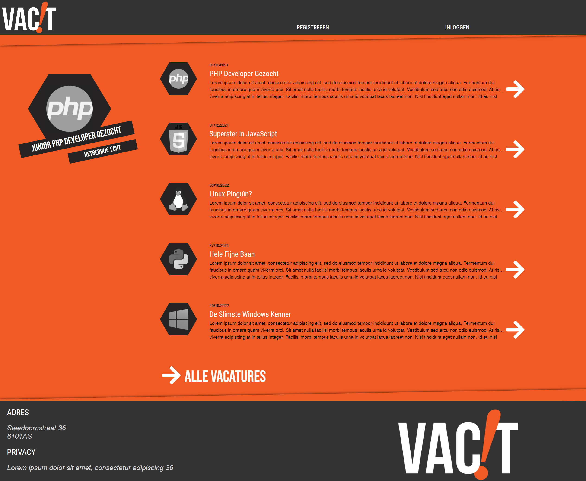
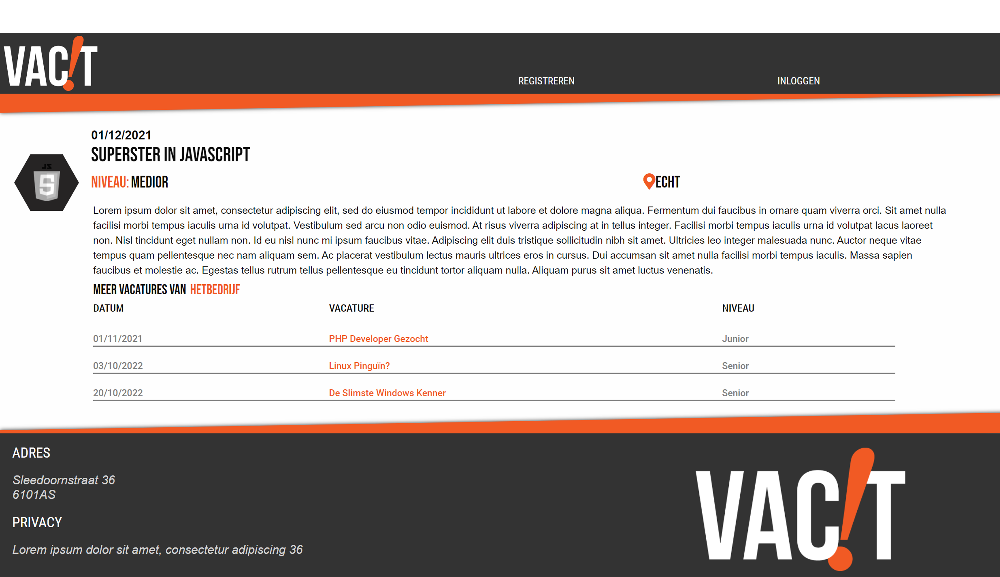
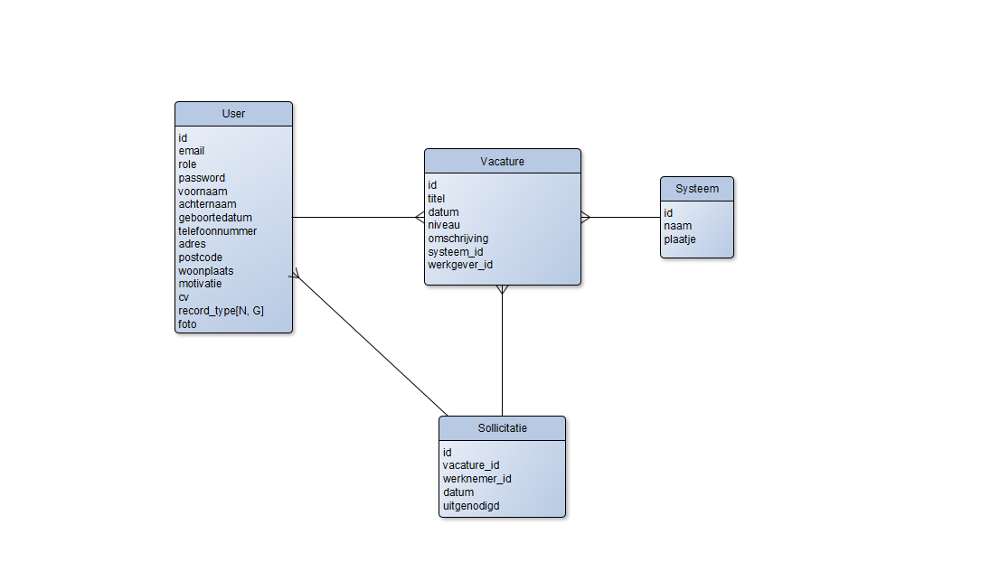
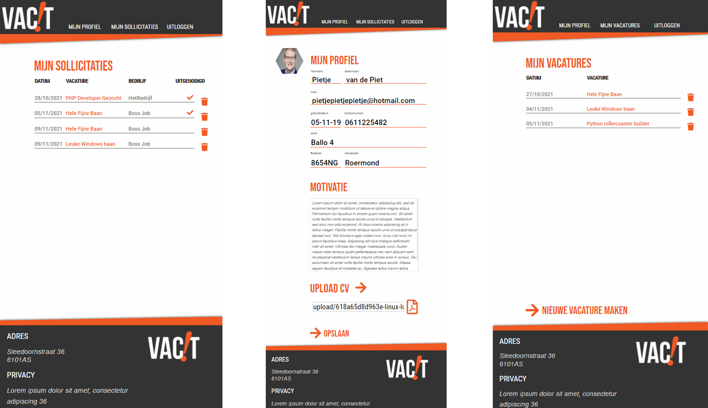

<h1>VacIt</h1>
De vacaturesite VacIt is door mij ontwikkeld voor een project van Educom. Op deze vacaturesite wordt aan de hand van verschillende functies en technieken een samenhangend concept geëtaleerd waar front-end en back-end methodes samen tot een geheel product komen.
  
Het project is van te voren uitgewerkt met een ASD en ERD, dit is gedaan om een duidelijk inzicht te geven in welke informatie nodig is om een vacaturesite te ontwikkelen. De bestandsdelen van de database zijn in kaart gebracht, en er is uitgewerkt welke relatie er tussen de entiteiten moet bestaan.
  

 
<h2>Technologieën </h2>
Voor het maken van deze applicatie/website is gebruik gemaakt van zowel back-end als front-end technologieën. De back-end is gemaakt aan de hand van symfony, waarbij entiteiten zijn aangemaakt en verbonden met een mySQL database die werd onderhouden aan de hand van phpMyAdmin. Deze database is te vinden in de map 'database'. De front-end is samengesteld met behulp van HTML en CSS binnen een template van Twig-Symfony.
 
Een volledige lijst van gebruikte technologieën:
 
<ul>
    <li>Symfony</li>
    <li>Twig</li>
    <li>MySQL/phpMyAdmin</li>
    <li>HTML/CSS</li>
    <li>PHP</li>
    <li>Foundation</li>
    <li>Javascript</li>
    <li>JQuery</li>
    <li>FontAwesome</li>
</ul>
 

<h2>Methoden & Technieken</h2>
<h3>Entity Relationship Diagram</h3>
Dit diagram laat zien hoe de verschillende primary keys in relatie staan met elkaar. De modellering hier van helpt bij het maken van een samenhangende database en met het koppelen van de losse facetten.
 

 

<h2>Mobile First</h2>
De applicatie is gebouwd met het oog op 'mobile-first'. Maar het programma moest uiteraard ook werken op systemen met een groter scherm. Responsive was daarom het keywoord bij het maken van deze applicatie. In de afbeeldingen is goed te zien hoe de front-end responsive werkt met grote en kleine schermen.
 

